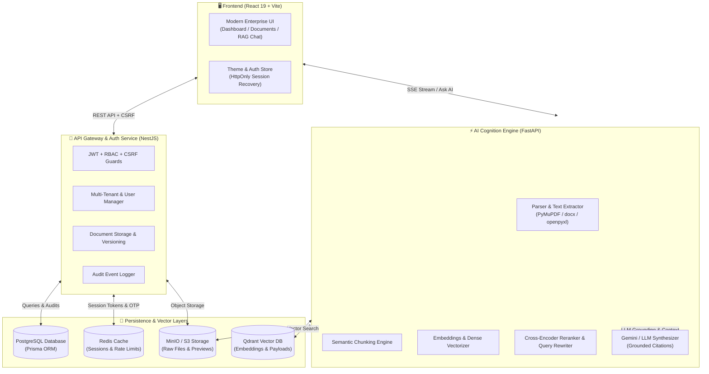

<p align="center">
  
</p>

<p align="center">
  <a href="#-architecture"></a>
  <a href="#-tech-stack"></a>
  <a href="#-tech-stack"></a>
  <a href="#-tech-stack"></a>
  <a href="#-security--rbac-model"></a>
  <a href="#license"></a>
</p>

<p align="center">
  <b>Idraak AI</b> (<i>ادراک</i>) is an enterprise-grade <b>Document Intelligence, Knowledge Base Scoping, and Hybrid RAG (Retrieval-Augmented Generation)</b> platform designed to transform massive organizational document repositories into structured, grounded, and conversational cognitive insights.
</p>

---

## 📖 The Philosophy of Idraak (ادراک)

> **Idraak** *(Arabic/Urdu/Persian: ادراک)*: The faculty of complete comprehension, deep perception, and intellectual cognition.

Traditional document search engines index keywords; they cannot *understand*. **Idraak AI** bridges the gap between raw unstructured files and deep contextual reasoning. By coupling **dense vector embeddings**, **lexical BM25 ranking**, **cross-encoder reranking**, and **bounding-box grounded citations**, Idraak provides authoritative answers with mathematical precision and zero hallucinations.

---

## ⚡ Core Superpowers

### 🧠 1. Cognitive Hybrid RAG Pipeline
- **Hybrid Retrieval**: Combines semantic dense vector search (Qdrant) and exact keyword sparse scoring (BM25) for high-recall document discovery.
- **Context-Aware Query Rewriting**: Automatically analyzes multi-turn conversational history to formulate self-contained, optimized search queries.
- **Page-Level Bounding-Box Citations**: Grounded LLM answers reference exact document pages, paragraphs, and visual bounding coordinates (`[x0, y0, x1, y1]`) for instant highlight verification.

### 🗂️ 2. Multi-Tier Knowledge Base Hierarchy
- **Structured Taxonomy**: Organize knowledge through a 4-tier scoping hierarchy:
  $$\text{Knowledge Base} \longrightarrow \text{Folder} \longrightarrow \text{Collection} \longrightarrow \text{Category / Tags}$$
- **Fine-Grained Retrieval Filters**: Search across the entire tenant workspace or restrict RAG queries to designated document collections with a single click.

### 🏢 3. Enterprise Multi-Tenancy & RBAC
- **Strict Tenant Isolation**: Complete data segregation across organizations with custom schemas, isolated document storage buckets, and dedicated vector namespaces.
- **Role-Based Access Control (RBAC)**: Fine-grained permissions (`documents.read`, `documents.upload`, `members.manage`, `analytics.view`, `platform.admin`).
- **Cryptographic Security**: Strict `HttpOnly`, `SameSite=Lax` cookie tokens, dual-token rotation, per-session revocation, and double-submit CSRF protection.

### ⚡ 4. High-Throughput Document Ingestion & Analytics
- **Multi-Format Extraction**: Ingest and parse PDF, DOCX, PPTX, XLSX, CSV, TXT, JSON, HTML, and ZIP archives.
- **Asynchronous Background Processing**: Offloads heavy text extraction, chunking, and embedding generation to dedicated worker queues without blocking user interactions.
- **Document Intelligence Dashboard**: Real-time visualization of upload activity spikes, storage consumption, file-format distributions, and user audit logs.

---

## 🏛️ System Architecture



---

## 💻 Tech Stack

| Domain | Technology | Purpose |
| :--- | :--- | :--- |
| **Frontend UI** | **React 19**, **Vite 8** | High-performance SPA with responsive dark/light modes and accessible design |
| **Styling & Icons** | **Modern Vanilla CSS & SVG** | Custom micro-animations, glassmorphism headers, responsive grids |
| **API Gateway** | **NestJS (Node.js/TypeScript)** | Enterprise REST backend, Prisma ORM, multi-tenant RBAC, CSRF, Cookie Auth |
| **AI & RAG Engine** | **FastAPI (Python 3.12)** | Text extraction, semantic chunking, vector indexing, query rewriting |
| **Vector Database** | **Qdrant** | High-dimensional dense embeddings and cosine similarity search |
| **Relational Database** | **PostgreSQL** | User identities, tenant workspaces, permission catalogs, and audit logs |
| **Cache & Queue** | **Redis** | Active session stores, sliding-window rate limiters, token rotation |
| **Object Storage** | **MinIO (S3 Compatible)** | Encrypted document storage, versioning blobs, and preview frames |
| **LLM Provider** | **Google Gemini / OpenAI** | Generative reasoning, query refinement, and citation extraction |

---

## 📁 Repository Structure

```text
├── Project 1/                          # 🖥️ Frontend Client (React 19 + Vite)
│   ├── public/                         # Brand assets, favicon, animated banner
│   ├── src/
│   │   ├── features/                   # Domain-driven feature modules
│   │   │   ├── access-control/         # Organizations, Roles, People Access (RBAC)
│   │   │   ├── auth/                   # Login, OTP verification, sessions
│   │   │   ├── dashboard/              # Analytics, charts, storage breakdown
│   │   │   ├── documents/              # File uploads, previews, RAG search chat
│   │   │   ├── knowledge-bases/        # Multi-tier Knowledge Base scoping
│   │   │   └── users/                  # User management & platform audit logs
│   │   ├── routes/                     # Authenticated layout & navigation shell
│   │   ├── shared/                     # UI components, theme store, alerts, modals
│   │   └── index.css                   # Enterprise typography, tables, dark mode tokens
│   ├── index.html                      # HTML entrypoint with Idraak AI branding
│   └── package.json
│
├── Back-End/                           # ⚙️ Dual Microservices & Infrastructure
│   ├── nestjs-api/                     # NestJS Gateway & Platform Manager
│   │   ├── prisma/                     # Database schema & migrations
│   │   └── src/
│   │       ├── modules/auth/           # HttpOnly cookie auth, CSRF, OTP mailer
│   │       ├── modules/documents/      # Storage coordinator & upload session manager
│   │       ├── modules/users/          # User CRUD, role assignments, audit logs
│   │       └── common/                 # Guards, interceptors, error filters
│   ├── fastapi-service/                # FastAPI AI Cognition & Retrieval Worker
│   │   └── app/
│   │       ├── services/               # Extraction, chunking, Qdrant, LLM service
│   │       └── routers/                # RAG query, hybrid search, ingestion routes
│   └── docker-compose.yml              # Local container orchestration
```

---

## 🚀 Quickstart & Setup

### 1. Prerequisites
- **Node.js**: `v20.x` or later
- **Python**: `v3.11` or `v3.12`
- **Docker & Docker Compose** (for PostgreSQL, Redis, Qdrant, MinIO)

---

### 2. Infrastructure Setup (Docker)

Start the backing services in the backend directory:

```bash
cd Back-End
docker-compose up -d postgres redis qdrant minio
```

---

### 3. NestJS API Gateway Setup

```bash
cd Back-End/nestjs-api

# Install dependencies
npm install

# Configure environment variables
cp .env.example .env

# Run Prisma migrations & seed
npx prisma migrate dev
npx prisma db seed

# Start development server
npm run start:dev
```
> The NestJS API Gateway will run on `http://localhost:3000` with Swagger documentation at `http://localhost:3000/api/docs`.

---

### 4. FastAPI AI Engine Setup

```bash
cd Back-End/fastapi-service

# Create virtual environment
python -m venv venv
source venv/bin/activate  # On Windows: venv\Scripts\activate

# Install requirements
pip install -r requirements.txt

# Configure environment variables
cp .env.example .env

# Start FastAPI service
uvicorn app.main:app --host 0.0.0.0 --port 8000 --reload
```
> The FastAPI service will run on `http://localhost:8000` with OpenAPI documentation at `http://localhost:8000/docs`.

---

### 5. Frontend Client Setup

```bash
cd "Project 1"

# Install dependencies
npm install

# Configure environment variables
cp .env.example .env

# Start Vite dev server
npm run dev
```
> Open your browser at `http://localhost:5173` to access **Idraak AI**.

---

## 🔒 Security & RBAC Model

```text
[ Incoming Request ]
        │
        ▼
[ CORS Origin Validation ] ───► Strict Origin Whitelist (http://localhost:5173)
        │
        ▼
[ Helmet Security Headers ] ──► HSTS, X-Frame-Options, No-Sniff, CSP
        │
        ▼
[ Rate Limiting Guard ] ──────► Redis sliding-window IP & user throttling
        │
        ▼
[ Cookie Session Guard ] ─────► HttpOnly, SameSite=Lax Access + Refresh Token Rotation
        │
        ▼
[ CSRF Protection Guard ] ────► Cryptographic Signed Double-Submit Secret Validation
        │
        ▼
[ RBAC Permission Guard ] ────► Verified against tenant organization scope & roles
        │
        ▼
[ Controller Execution ] ─────► Safe transactional execution & audit log dispatch
```

---

## 📊 Available Scripts

### Frontend (`Project 1`)
- `npm run dev` — Launch Vite live-reloading dev server
- `npm run build` — Compile production bundle with Vite & Oxlint checks
- `npm run preview` — Locally preview the production build

### Backend Gateway (`nestjs-api`)
- `npm run start:dev` — Start NestJS in watch mode
- `npm run build` — Build production TypeScript distribution
- `npx prisma studio` — Visual browser-based database manager

---

## 📄 License

This project is licensed under the **MIT License** — see the [LICENSE](LICENSE) file for details.

<p align="center">
  <sub>Built with precision for intelligent enterprise document cognition. Powered by <b>Idraak AI</b>.</sub>
</p>
